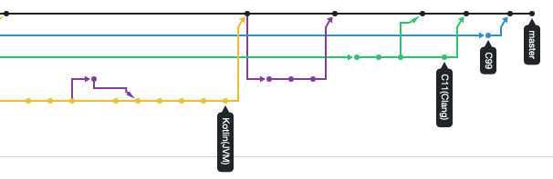

## [PJ1] The Study of Algorithms

This project is a study of various algorithms using various languages. Try to solve as many and study concepts with other's codes in BOJ.

**Objective** Solve various algorithm problems with various languages
**Keywords** Algorithms, Languages, BOJ (Baekjoon Online Judge), ICPC
**Duration** 2019.03-Ongoing
**Proportion** 100% (Sole)
**Skills** Kotlin, C++, Python, C, Shell

 

 

### OUTPUT

- [SRC] https://github.com/onsoim/BOJ
- [TIER] https://solved.ac/profile/onsoim
- [A4] 2019. Honorable Mention. ICPC SEOUL 2019, ICPC.Foundation

 

### WHAT I'VE LEARNED

1. Time & Space complexity
2. Various algorithm
3. Review and Study others' codes
4. Pros and cons of various languages
5. Differences between each language
6. Algorithms cannot be used in development directly but know that it helps a lot.
