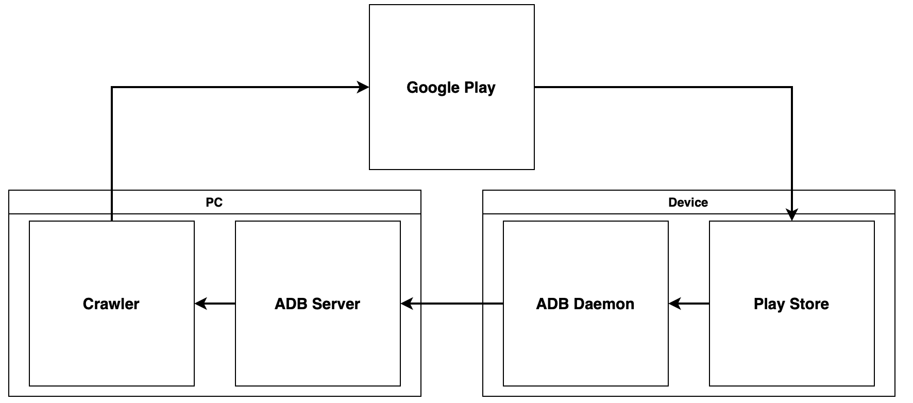

## [PJ8] Develop an apk crawler

This project is the development of an APK crawler. The flow of APKcrawler is as below.

1. Crawler keeps asking Google Play to install a new APK on an Android device.
2. Then Google Play sends a response to the device for installation.
3. Play Store in Android installs the corresponding APK in response.
4. When the requested APK is installed, the ADB Daemon packs and sends it to the ADB Server.
5. Crawler collects all APKs received by ADB Server.
6. Repeat 1-5.

**Objective** Develop and maintain a discord bot for SAG (SSG Algorithm Group) 
**Keywords** Automation, adb, google play, SQL, multiprocessing 
**Duration** 2022.02-2022.02 (1 month) 
**Proportion** 100% (Sole) 
**Skills** Python, adb, pickle, SQLite, selenium

 

### OUTPUT

- [SRC] https://github.com/onsoim/APKcrawler
- [BLOG] https://onsoim.tistory.com/entry/undetectedchromedriver

 

### WHAT I'VE LEARNED

1. Control ADB using Python
2. Use pickle to save and load data easily
3. Analyze the principle of bypass routine and apply it to an unsupported platform
4. Use ‘selenium’ to automate the process, ‘SQLite’ to manage a list of APKs, ‘multiprocess' to speed up, and ‘inspect’ to get the caller’s info
5. Add a dynamic absolute path to avoid path issues
6. Apply an experience (e.g.,heapq) to the project
