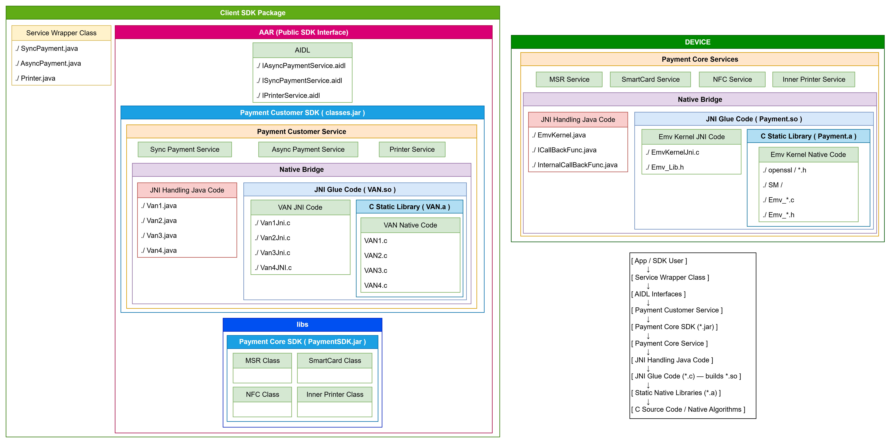

## [PJ11] Management of outsourcing development project

**Objective** Managing outsourcing development project  
**Keywords** Payment, Android Service, SP(Secure Processor) 
**Duration** 2024.06-24.11 (6 months) 
**Proportion**  
**Skills** Java, Android, Figma

 

### ROLE

1. Code Review
    - AP(Application Processor)
    - SP(Secure Processor)
    - Test Applications
        - MSR
        - IC
        - NFC
        - Printer
        - Secure
        - etc.
    - Documents(Java docs, Manual ...)
2. API Implementation Test
2. Development of test applications
    - more details on [PJ12](../pj12/pj12.md)
3. Give feedbacks to the outsourcing companies

 

### OUTPUT

- SP60 SDK Test Application
    - API Unit Test
    - Scenario based Test
        - MSR Test
        - IC Test
        - NFC Test
        - Fallback Test
        - Printer Test
        - Barcode Test
    - Payment Test
        - Init
        - Detect interafaces
        - Start Transaction
        - Deinit

 

### WHAT I'VE LEARNED

1. 
