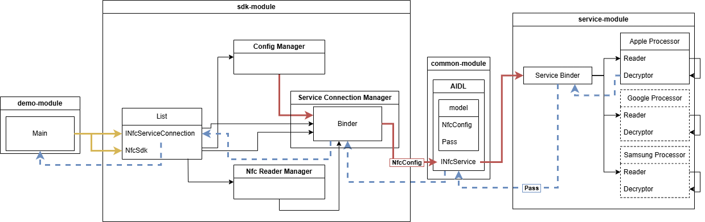
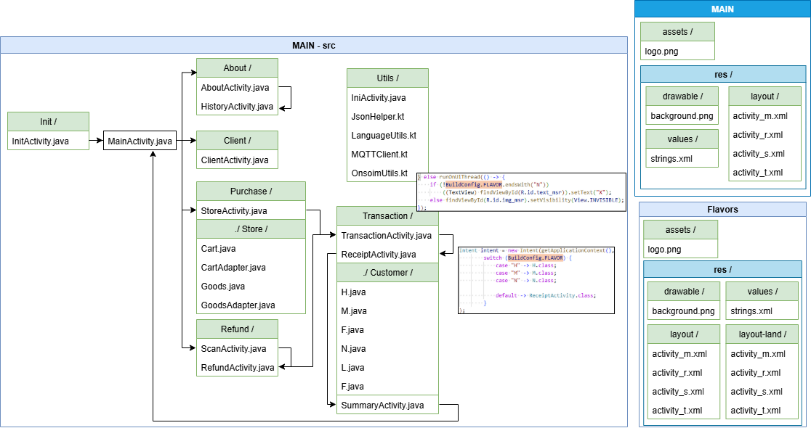
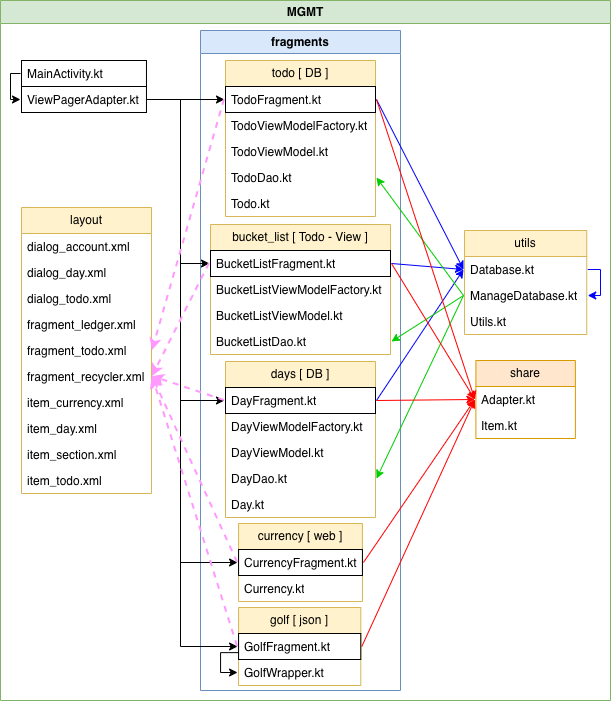
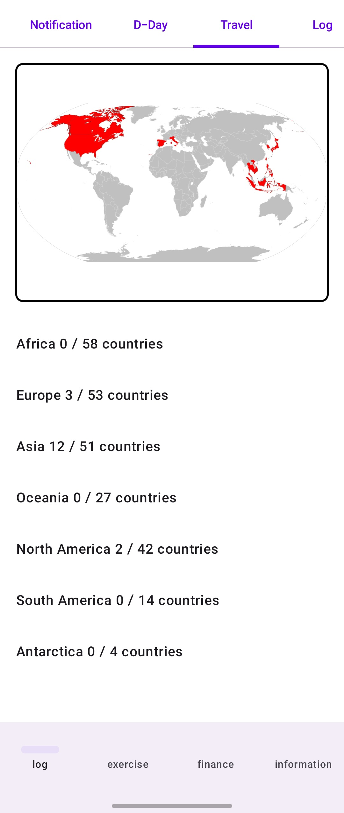
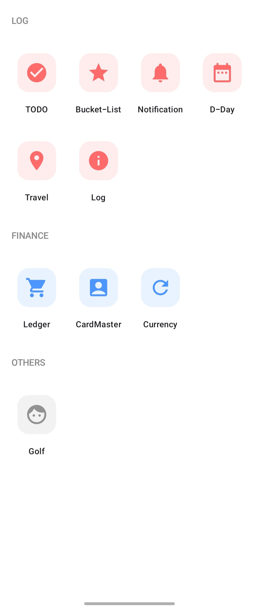
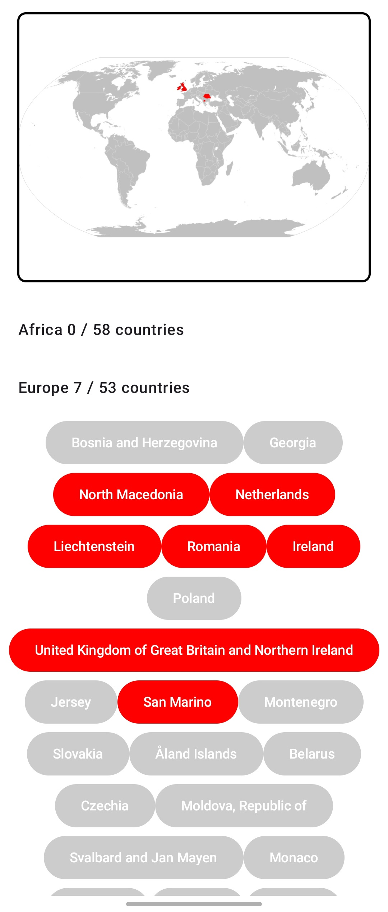

# [류민수] 포트폴리오

📧 [onsoim@gmail.com](mailto:onsoim@gmail.com) | 🔗 [LinkedIn](https://www.linkedin.com/in/onsoim) | 🔗 [GitHub](https://github.com/onsoim/onsoim)

> **"카드 읽기부터 VAN 승인까지, 오프라인 결제에 필요한 전 과정을 경험한 6년 차 안드로이드 엔지니어"**

## SELECTED PROJECTS

### * [PJ17] Apple VAS 기반 비접촉 서비스 Full-cycle 개발

#### 1. 개요

- **Description:** Apple 기기 비접촉 데이터 교환(VAS) 프로토콜을 분석하고, 이를 안드로이드 단말기에서 원활하게 처리할 수 있는 통합 솔루션(Demo-SDK-Service) 설계 및 개발
- **Role:** 1인 주도 개발 (프로토콜 분석, 시스템 아키텍처 설계, SDK 및 백그라운드 서비스 구현)
- **Tech Stack:** `Kotlin`, `Apple VAS`, `NFC (ISO 14443)`, `AIDL (IPC)`, `Jetpack Compose`

#### 2. 핵심 기술 과제 및 해결

**Challenge 1:** Apple VAS의 독자적 분석 및 엔진 구현

- **Situation:** 기존의 NFC 결제(EMV)를 넘어, Apple Wallet 내의 **멤버십, 쿠폰, 스마트 티켓** 등을 비접촉으로 교환하는 **Apple VAS** 프로토콜 도입이 필요함
- **Task:** 결제 프로세스와 별개로 동작하는 Apple VAS 특유의 **상호 인증(Mutual Authentication)** 및 비접촉 데이터 교환 시퀀스를 분석하고, 실물 단말기에서 안정적으로 동작하는 전용 프로토콜 스택을 구현
- **Action:**
    - **프로토콜 스택 설계:** Apple 공식 기술 사양서를 전수 분석하여 단말기(Terminal)와 iPhone 간의 **VAS 응답 시퀀스(Select Apple VAS → Get Vas Data → Decrypt Vas Data)**를 설계 및 구현
    - **데이터 무결성 검증:** 통신 과정에서 발생하는 **APDU 데이터를 실시간으로 캡처**하여 규격 준수 여부를 검증하고 복호화 로직을 구현하여 암호화 데이터의 정합성을 확보
    - **예외 케이스 최적화:** 실물 iPhone과의 반복 테스트를 통해 규격서에 명시되지 않은 응답 지연이나 필드 예외 사항을 파악하고, 이에 대응하는 예외 처리 로직을 구축
- **Result:** 사내 최초 **독자적인 Apple VAS 엔진 구현 성공 및 단말기 탑재 완료.** 결제뿐만 아니라 **마케팅/멤버십 서비스로 확장이 가능한 기술적 기반**을 마련하여 사내 기술 자산화에 기여

---

**Challenge 2:** 타사 SDK 호환성 확보 및 인터페이스 최적화

- **Situation:** 기존 시장을 점유하고 있는 경쟁사 단말기 사용 고객(파트너사)을 흡수하기 위해, 기존에 사용하던 경쟁사 SDK 인터페이스와의 높은 호환성이 요구됨
- **Task:** 경쟁사 SDK의 기능을 완벽히 대체함과 동시에, 파트너사 개발자들이 우리 솔루션으로 최소한의 비용으로 마이그레이션할 수 있도록 인터페이스 재설계 필요
- **Action:**
    - **경쟁사 구조 분석:** 타사 SDK의 복잡한 API 구조와 객체 생명주기를 분석하여, 불필요하게 파편화된 호출 단계와 의존성 파악
    - **인터페이스 최적화 설계:** 기존 SDK의 번거로운 설정 과정을 단순화하고, 여러 단계로 나뉘어 있던 초기화 및 활성화 과정을 **Facade 패턴** 등을 적용하여 직관적인 단일 진입점으로 재설계
- **Result:** **타사 SDK 대비 API 호출 단계 50% 단축 및 호출 복잡도 개선**. 파트너사의 마이그레이션 공수를 줄임으로써 **신규 고객사 전환 장벽을 낮추고 비즈니스 경쟁력을 확보**

| 기존 경쟁사 SDK | `init()` → `createVasConfig()` → `setVasConfig()` → `enablePassMode()` |
| --- | --- |
| **신규 설계 SDK** | `init(config)` → **`enablePassMode()`** |

---

**Challenge 3:** 이기종 프로토콜 대응을 위한 인터페이스 추상화

- **Situation:** Apple VAS 외에도 Google SmartTap, Soft POS 등 다양한 비접촉 프로토콜이 존재하며, 규격마다 요구되는 인증 시퀀스와 데이터 포맷이 상이하여 코드 파편화 및 유지보수 복잡도가 증가할 위험이 존재함
- **Task:** 신규 규격이 추가될 때마다 메인 로직을 수정하지 않고, 최소한의 구현체 추가만으로 확장이 가능한 플러그인 형태의 확장 구조 설계 필요
- **Action:**
    - **Interface-based Abstraction:** 각 프로토콜의 공통 행위(connect, readPass, disconnect 등)를 정의하는 `INfcServiceConnection` 인터페이스를 설계하여 SDK 레이어와 구체적인 프로토콜 로직을 엄격히 분리함
- **Result:** 향후 신규 규격(SmartTap 등) 도입 시 **기존 코드 수정 없이 70% 이상의 공수 절감**이 가능한 확장성 확보

---

**Challenge 4:** SDK와 서비스 간의 안정적인 데이터 동기화 (IPC)

- **Problem:** 보안 및 성능상의 이유로 VAS 핵심 로직은 **백그라운드 서비스**에서 독립적으로 동작해야 하며, 이를 외부 파트너사 앱(SDK)이 SDK를 통해 안전하고 실시간으로 제어할 수 있는 구조가 필요
- **Decision:** 데이터 전송 효율과 안드로이드 표준 보안 모델을 준수하기 위해 **AIDL(Android Interface Definition Language)** 기반의 IPC(Inter-Process Communication) 통신 체계를 채택
- **Action:**
    - **AIDL 로직 캡슐화:** 서비스 바인딩, 커넥션 관리, 예외 처리 등 AIDL의 복잡한 라이프사이클을 SDK 내부로 숨겨, 파트너사 개발자는 내부 구현을 몰라도 메서드 호출 한 번으로 VAS 기능을 즉시 사용할 수 있도록 직관적인 API 제공
    - **상태 동기화 및 이벤트 콜백:** 서비스의 상태 변화(데이터 교환 성공/실패 등)를 SDK를 통해 실시간으로 비동기 전달받을 수 있도록 **Listener 패턴 기반의 콜백 구조**를 설계
- **Result:** 프로세스 간 통신 시 오버헤드를 최소화하고, 외부 앱 환경에서도 데이터 누락 없는 **끊김 없는 VAS 경험** 제공

#### 3. 성과 및 영향

- **기술 자산화:** Apple 공식 문서를 기반으로 독자적인 ISO-DEP 기반 통신 스택을 구축하여 사내 핵심 기술 자산 확보
- **개발 생산성 향상:** 검증용 Demo 앱부터 실제 배포용 SDK까지 Full-cycle을 1인 주도로 구축하여 전체 아키텍처의 일관성 유지 및 디버깅 효율 증대
- **사업적 가치:** Apple 기기 사용자 대상의 신규 결제 비즈니스 모델(멤버십, 티케팅 등) 수립의 기술적 토대 마련

#### 4. 회고

- **Lessons Learned:**
    - **하드웨어 제어 기반의 도메인 심화:** 단순히 스펙 문서를 구현하는 수준을 넘어, Apple Wallet을 능동적으로 감지하기 위한 **ECP(Enhanced Contactless Polling)**를 **HAL(Hardware Abstraction Layer)**에서 제어하며 NFC 로우레벨을 경험했습니다. 구형부터 최신형까지 다양한 iPhone 디바이스로 직접 테스트하며 하드웨어 세대별 차이를 극복하고 안정성을 확보하는 법을 배웠습니다.
    - **사용자 중심(DX)의 아키텍처:** SDK 개발 과정에서 기술적 복잡도를 내부로 캡슐화하는 것이 파트너사의 연동 비용을 얼마나 혁신적으로 낮추는지 확인했습니다. ‘내가 편한 설계’보다 **‘연동하는 개발자가 고민할 필요 없는 설계’**가 비즈니스의 확장 속도를 결정짓는 핵심 변수임을 깊이 깨달았습니다.
- **Future Improvement:**
    - **보안 아키텍처 고도화:** 현재 구현된 복호화 로직을 넘어, Pass 데이터 처리에 필요한 개인키(Private Key)와 민감 로직을 **Android TEE(Trusted Execution Environment) 및 KeyStore(혹은 StrongBox)** 영역으로 격리하여 보안 무결성을 강화하는 작업을 계획 중입니다.

### * [PJ12] BMT/PR Events 결제 앱 개발

#### 1. 개요

- **Description:** 신규 단말 성능 검증(BMT) 및 대외 홍보용 이벤트 앱 10종의 개발과 운영을 담당. 각기 다른 요구사항으로 파편화된 코드 베이스를 통합하고 결제 프로세스의 안정성을 극대화함
- **Role:** 안드로이드 메인 개발 및 아키텍처 통합 주도
- **Tech Stack:** `Java`, `Kotlin`, `Build Flavor`, `Room`, `Multi-threading`, `MQTT`, `Bluetooth`

#### 2. 핵심 기술 과제 및 해결

**Challenge 1:** 10종의 파편화된 앱 통합 및 유지보수 효율화

- **Situation:** 이벤트 및 고객사별 요구사항에 따라 프로젝트가 개별 생성되어 총 10개의 저장소가 운영됨. 기능 수정 시 10번의 중복 작업이 발생하고 코드 정합성을 유지하기 어려움
- **Task:** 공통 결제 로직은 하나로 관리하되, 고객사별 특화 기능(UI/UX, 로직 등)만 유연하게 분리할 수 있는 단일 코드 베이스(Single Codebase) 구축
- **Action:**
    - **Build Flavor 기반 멀티 타겟 설계:** 빌드 시스템을 활용하여 앱별 리소스(로고, 테마 등)를 분리하고, 비즈니스 로직은 공통 모듈로 통합하는 구조를 설계
    - **Interface 기반 모듈화:** 전자 영수증, 특정 결제 수단 등 고객사별로 상이한 기능은 인터페이스로 추상화하여, 빌드 시점에 적절한 구현체가 주입되는 구조를 설계
- **Result:** 신규 앱 런칭 공수 및 유지보수 리소스를 **기존 대비 90% 이상 절감**하여 비즈니스 변화에 즉각 대응할 수 있는 환경을 구축

---

**Challenge 2:** 결제 프로세스 중 ANR(App Not Responding) 해결 및 성능 최적화

- **Problem:** 복잡한 결제 로직과 외부 장비(MQTT/Bluetooth) 통신이 메인 스레드를 점유하여, 결제 중 UI가 프리징되거나 시스템에 의해 앱이 강제로 종료되는 **ANR 이슈**가 발생
- **Decision:** UI 스레드와 비즈니스 로직의 완전한 분리를 통한 사용자 경험 개선
- **Action:**
    - **Multi-threading 구조로 재설계:** 실시간성이 중요한 외부 장비 통신과 무거운 결제 커널 통신을 별도의 백그라운드 스레드 풀에서 처리하여 UI 스레드의 부하를 제거
    - **Message-driven Architecture:** 결제 상태 변화를 메시지 형태로 전달받아 UI를 업데이트하는 구조를 적용하여 스레드 간 간섭을 최소화
- **Result:** 결제 프로세스 중 **ANR 발생률 0%** 달성. 극한의 BMT 환경에서도 끊김 없는 사용자 경험을 제공하여 단말기 신뢰도를 향상

#### 3. 성과 및 영향

- **비즈니스 성장 기여:** 안정적인 단말 검증 및 고품질 이벤트 앱 운영을 통해 **신규 고객사 6건 수주**에 기술적으로 기여
- **표준화 가이드 구축:** 이후 진행된 프로젝트의 표준이 되는 **결제 모듈 코어 베이스**를 확립하고, 후속 프로젝트들의 개발 속도와 품질을 상향 평준화

#### 4. 회고

- **Lessons Learned:**
    - **확장성을 고려한 초기 설계의 중요성:** Build Flavor와 모듈화를 통해 운영 비용을 획기적으로 줄이는 경험을 하며, 아키텍처 설계가 비즈니스 속도에 미치는 영향을 체감했습니다.
    - **시스템 안정성 확보:** 로그 분석을 통해 ANR의 근본 원인을 추적하고 해결하며, 안드로이드의 스레딩 모델과 성능 최적화에 대한 실무적 통찰을 얻었습니다.
- **Future Improvement:**
    - **비동기 프로그래밍 고도화:** 프로젝트 진행 당시 팀 내 기술 스택(Java 위주)을 고려하여 멀티 스레딩으로 구현했으나, 향후에는 Kotlin Coroutines을 도입하여 코드의 가독성과 상태 관리의 안정성을 한 단계 높이고 싶습니다.
    - **기술 공유와 리딩:** 팀 전체의 기술 성장을 위해 최신 비동기 처리 기법을 팀 내에 전파하고 도입을 주도하는 역할을 수행하고자 합니다.

### * [PJ10] Mastercard Contactless L2 결제 커널 개발 및 EMV 인증 획득

#### 1. 개요

- **Description:** 기존 Mastercard Contactless 결제 커널을 기반으로 최신 규격에  맞게 시스템을 분석 및 고도화하여, 차세대 **Mastercard Contactless L2 인증을 획득**함
- **Role:** 레거시 커널 분석, 신규 규격 대응 로직 설계 및 인증 프로세스 주도
- **Tech Stack:** `C`, `RTOS`, `EMV Spec`, `NFC(ISO 14443)`, `APDU Analysis`

#### 2. 핵심 기술 과제 및 해결

**Challenge 1:** 최신 규격과의 델타 분석 및 아키텍처 정합성 확보

- **Situation:** 기존 커널이 구형 규격에 맞춰져 있어 최신 Mastercard Contactless 사양의 보안 및 데이터 처리 기준을 충족하지 못함
- **Task:** 기존 코드의 구조적 안정성을 유지하면서, 최신 사양의 차이점(Delta)을 반영하여 수천 개의 인증 테스트 케이스를 통과시키는 것
- **Action:**
    - **스펙 비교 분석:** 최신 규격서와 기존 로직을 대조하여 신규 추가된 보안 요구사항 및 데이터 처리 필드를 식별
    - **APDU 로그 정밀 분석:** 통신 과정에서 발생하는 APDU(Application Protocol Data Unit) 로그를 전수 분석하여, 규격과 미세하게 어긋나는 필드 값 및 타이밍 이슈를 포착
- **Result:** 수천 개의 인증 테스트 시나리오를 모두 통과하며 **Mastercard Contactless L2 인증 획득**

---

**Challenge 2:** 장기 신뢰성 검증 과정에서의 레거시 이슈 해결 (메모리 최적화)

- **Problem:** 임베디드 환경의 특성상 가용 메모리가 극히 제한적인 상황에서, 장시간 연속 트랜잭션 테스트 시 메모리 누수가 누적되어 OOM(Out of Memory) 현상이 발생하고 시스템이 재부팅되는 문제를 발견
- **Decision:** 기존 메모리 할당/해제 생명주기의 전면 재검토를 통한 시스템 최적화 및 가용성 확보
- **Action:**
    - **메모리 릭 추적 및 해결:** 장시간 연속 트랜잭션 로그를 분석하여 메모리를 제대로 해제하지 않는 특정 모듈을 식별하고 코드를 수정
    - **부하 테스트 수행:** 수천 건 이상의 연속 트랜잭션을 시뮬레이션하며 메모리 사용량의 선형적 증가 여부를 실시간으로 모니터링하고 최적화

#### 3. 성과 및 영향

- **인증 확보:** 최신 Mastercard 공식 인증 획득을 통해 결제 시장에서의 단말기 기술 경쟁력을 확보
- **자산 고도화:** 레거시 코드의 잠재적 결함을 해결하고 구조를 정돈하여, 최신 규격 대응을 위한 안정적인 베이스 코드를 마련

#### 4. 회고

- **Lessons Learned:**
    - **표준의 중요성:** ‘표준’을 구현한다는 것이 얼마나 엄격한 정밀도를 요구하는지 배웠으며, 문서를 넘어 로그 단위로 파고드는 집요함이 문제 해결의 핵심임을 깨달았습니다.
    - **임베디드 역량 강화:** 자원이 제한된 환경에서 효율적인 코드를 작성하는 법과 하드웨어-소프트웨어 간의 긴밀한 상호작용에 대한 깊은 이해를 얻었습니다.
- **Future Improvements:**
    - 브랜드별로 파편화된 결제 커널들을 공통 프레임워크 형태로 추상화하여, 중복 코드를 제거하고 향후 유지보수 효율을 극대화하는 방향으로 고도화하고 싶습니다.

### * [PJ16] MGMT 애플리케이션 개발

#### 1. 개요

- **Description:** 복잡한 계층형 메뉴 구조를 직관적인 **Launcher Style**로 개편하고, 기존 View System 기반 프로젝트를 **Jetpack Compose**로 마이그레이션하며 UI 생산성과 유지보수성을 극대화하는 개인 연구 프로젝트
- **Tech Stack:** `Kotlin`, `Jetpack Compose`, `Flow`, `Room`, `MVVM`, `View System`

#### 2. 핵심 기술 과제 및 해결

**System Architecture:** 도메인 간 결합도 완화 및 지능형 연계 프레임워크 설계

- **Situation:** 개별 마이크로 기능(Todo, D-day, 알림 수집 등)이 독립적으로 운영되어 도메인 간 데이터 단절이 발생하고, 사용자의 복합적인 맥락을 파악하여 능동적인 인사이트를 제공하기 어려운 구조적 한계가 존재함
- **Task:** 기능 간의 직접적인 참조를 제거하여 결합도를 낮추는 동시에, 특정 이벤트 발생 시 서로 다른 도메인의 데이터를 유기적으로 결합하여 초개인화된 가치를 창출하는 ‘지능형 연계 프레임워크’ 설계
- **Key Design Roadmap (Todo):**
    - **비동기 이벤트 파이프라인 설계:** 카드 결제 문자 수집이나 일정 등록 등 특정 상태 변화를 이벤트로 발생하고, 이를 구독하는 모듈들이 즉각 반응하는 `Event-Driven Interaction` 구조를 도입하여 실시간 반응성을 확보
    - **Context Mapping 및 시나리오 통합:** 저수준의 로우 데이터(GPS, 시간 등)를 사용자의 의도로 해석하는 지능형 레이어를 구축하여, “여행 일정 사이(Schedule) + 근처 맛집(Location) + 특정 카드 할인(Finance)”과 같은 복합 도메인 시나리오 로직 도출
    - **Intelligence Feedback Loop:** 앱이 제안한 인사이트에 대한 사용자의 반응(수락/거절)을 다시 데이터화하여 연계 로직을 고도화하는 학습 체계 설계
- **Expected Outcome:** 개별 기능의 단순 합을 넘어, 데이터 연계를 통해 새로운 가치를 창출하는 초개인화 맞춤형 비서 플랫폼의 기술적 기반을 마련함. 이를 통해 기능 확장이 용이한 유연한 데이터 생태계를 구축하고, 사용자에게 단순 알림 이상의 유의미한 인사이트를 제공함

---

**Challenge 1:** Room과 Flow를 활용한 실시간 반응형 데이터 흐름 구축

- **Problem:** 데이터 변경 사항이 UI에 즉각 반영되지 않거나, 수동으로 화면을 갱신해야 하는 비효율적인 상태 관리
- **Decision:** Single Source of Truth(SSOT) 기반의 실시간 반응형 데이터 흐름 구축
- **Action:**
    - **Reactive Stream 구축:** Room Database의 쿼리 결과를 **Flow** 형태로 스트리밍하여, DB가 업데이트될 때마다 UI가 자동으로 리컴포지션(Recomposition)되도록 설계
    - **UDF(Unidirectional Data Flow) 패턴:** ViewModel을 통해 상태(State)는 아래로, 이벤트는 위로 전달하는 단방향 흐름을 엄격히 준수하여 상태 예측 가능성을 확보
- **Result:** 데이터와 UI 간의 정합성을 완벽히 유지하고, 별도의 갱신 로직 없이도 **실시간 동기화되는 안정적인 앱 환경**을 구현

---

**Challenge 2:** Generic 기반 공통 Adapter 설계를 통한 보일러플레이트 제거

- **Problem:** 초기 View System 기반 개발 시, 수많은 Fragment에서 반복적으로 생성되는 `RecyclerView.Adapter`와 `ViewHolder` 코드로 인해 유지보수 효율이 저하
- **Decision:** Generic 기반 공통 Adapter를 설계하여 보일러플레이트 해소
- **Action:**
    - **Generic Base Adapter 개발:** 데이터 타입에 관계없이 동작하는 제네릭 기반 공통 어댑터를 설계하여, 새로운 리스트를 추가할 때마다 발생하는 반복적인 구현 코드를 제거
    - **Base ViewHolder 추상화:** 공통적인 바인딩 로직을 상속 구조로 설계하여 코드의 응집도를 향상
- **Result:** 어댑터 관련 중복 코드를 60% 이상 제거하였으며, 현재는 이를 Compose로 치환하여 더 높은 생산성을 확보하고 있음

---

**Challenge 3:** 레거시 View System의 단계적 Compose 마이그레이션

- **Situation:** 기존 명령형 UI(XML)는 상태 관리의 복잡도가 높고 코드 응집도가 낮아, 신규 기능을 추가할 때마다 보일러플레이트 코드가 증가하는 한계가 있음
- **Task:** 기존 비즈니스 로직과 이미 검증된 Fragment 자산을 최대한 재사용하면서, 메인 진입점부터 **Jetpack Compose**로 전환하는 단계적 마이그레이션 구조 설계가 필요
- **Action:**
    - **Main Entry Point 전환:** XML 기반의 `MainActivity` 레이아웃을 Compose 기반으로 전면 개편하여 선언형 UI의 진입점을 확보
    - **Fragment 상호운용성 확보:** 기존에 구현된 다수의 Fragment를 폐기하지 않고, `FragmentContainerView`를 Compose 컴포넌트로 래핑하여 선언형 UI 환경에서도 기존 View 자산을 재사용할 수 있는 브릿지 구조를 설계
    - **신규 기능의 선언형 구현:** 마이그레이션 환경 위에서 신규 기능들은 순수 Compose 컴포넌트로 개발하여, 레거시와 신규 스택이 공존하는 **Hybrid UI 아키텍처**를 구축
- **Result:** 기존 기능의 안정성을 유지하면서도 신규 개발 생산성을 극대화. 전체 UI 코드의 **상태 관리 로직을 단순화**하고, 향후 전체 기능을 Compose로 완전히 전환할 수 있는 **기술적 토대**를 마련

---

**Challenge 4:** 복잡한 내비게이션 구조의 UX 개편

- **Problem:** 기존의 깊은 계층형 메뉴(Nested Navigation)는 사용자가 원하는 기능에 접근하기까지 반복적인 뎁스 이동이 필요하며 원하는 기능을 찾기가 어려운 문제가 존재
- **Decision:** 모든 기능에 즉시 접근 가능한 Flat한 Launcher 기반 UI로의 전면 재설계

    
    
    

- **Action:**
    - **Information Architecture 최적화:** 복잡하게 얽혀 있던 메뉴 구조를 단일 레이어의 런처 스타일로 시각화하고, 사용자 동선을 최소화하는 UX를 구축
    - **확장 가능한 네비게이션 설계:** 새로운 기능(앱)이 추가되어도 레이아웃 수정 없이 동적으로 메뉴를 추가할 수 있도록 데이터 기반의 동적 UI 렌더링 로직을 구현
- **Result:** 메뉴 접근 단계를 축소하여 사용자 편의성을 강화했으며, 기능 추가 시 UI 수정 공수를 최소화할 수 있는 확장성을 확보

#### 3. 성과 및 영향

- **기술 부채 해결의 이정표:** 레거시 View System에서 **Jetpack Compose로의 단계적 전환**을 성공적으로 시뮬레이션하여, 실무 프로젝트 마이그레이션을 위한 **Low-risk 기술 로드맵** 확보
- **반응형 아키텍처 정립:** Room과 Flow를 결합한 **단방향 데이터 흐름** 모델을 통해 상태 관리의 복잡도를 제거하고, 코드의 예측 가능성과 테스트 용이성 극대화
- **미래 지향적 확장성 설계:** 도메인 간 결합도를 낮춰, 기능 추가가 시스템 전체에 미치는 영향을 최소화하는 유연한 생태계 구축

#### 4. 회고

- **Lessons Learned:**
    - **단계적 마이그레이션의 전략적 가치:** 모든 코드를 한 번에 바꾸는 리스크 대신, `FragmentContainerView`를 활용한 브릿지 구조를 설계하며 기존 자산을 보호하면서 신규 기술을 도입하는 현실적인 아키텍처 전략을 체득했습니다.
    - **선언형 UI의 가치:** Compose가 단순한 UI 도구를 넘어, 상태 관리와 아키텍처 설계 방식에 얼마나 긍정적인 변화를 주는지 체감했습니다.
- **Future Improvement:**
    - **Compose Multiplatform 확장:** 진행 중인 마이그레이션을 100% 완료하고, Compose Multiplatform으로의 확장을 통해 동일한 코드로 다양한 플랫폼(Desktop, Web)을 지원하는 구조를 연구할 계획입니다.

*최종 수정: 2026.03*